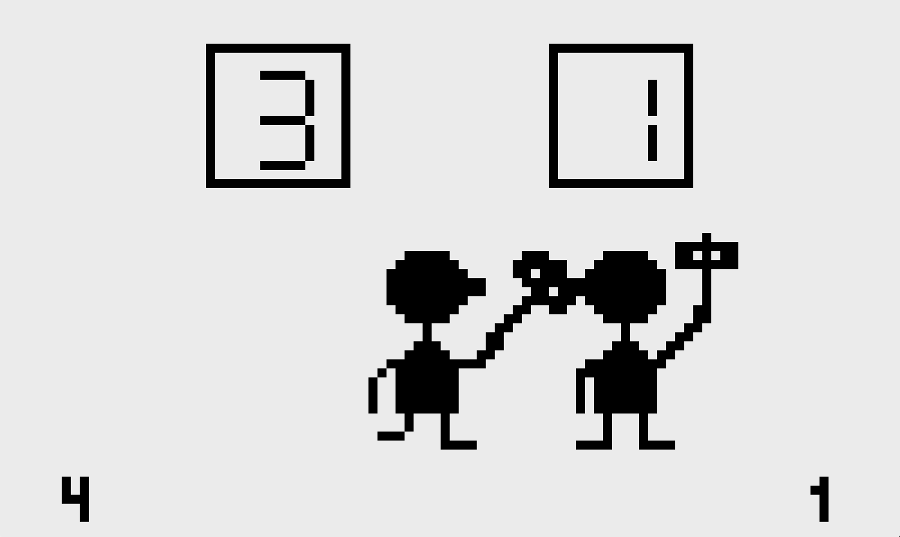

# judge
このゲームは任天堂の GAME&WATCH "JUDGE" を参考にして Python 3.9.6 と Pyxel 1.8.21 を使用して作成しました。

## ルール
- 左側のキャラクターを操作する。
- キャラクターの上に表示された数字が敵よりも大きいときに叩く、小さいときに避けると加点される。
- 数字が敵よりも大きいのに避けたり、小さいのに叩いたりすると減点される。
- 先に５点取った方が勝ち。

## 操作説明
#### タイトル画面
- Enterキーを押してゲーム開始
#### プレイ画面
- Jキーで避ける
- Kキーで叩く
#### 終了画面
- ESCキーで画面を閉じる
